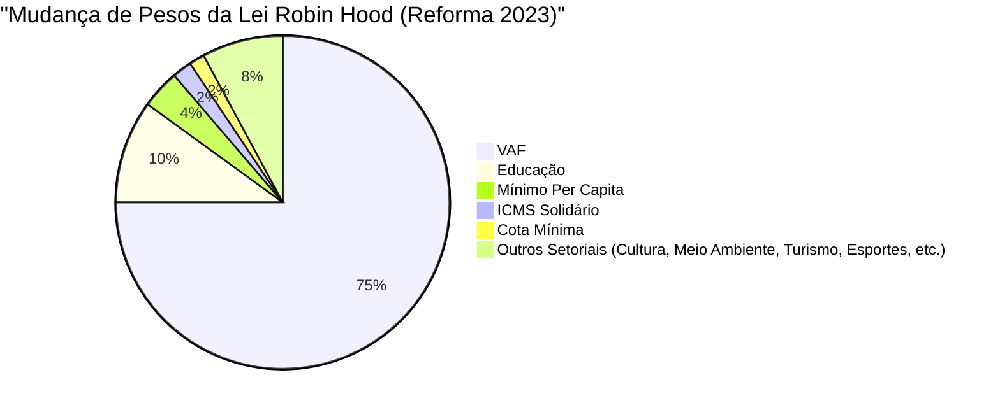

# 📊 Análises de Repasse e Impacto (ICMS Solidário)

Este documento apresenta análises técnicas, diagnósticos de impacto legislativo e orientações práticas para a interpretação de dados publicados pelos órgãos oficiais do Estado de Minas Gerais (FJP, SEF e secretarias setoriais).

---

## 🔍 1. A Diferença entre Índices Setoriais (SEMAD) e Repasses Reais (FJP)

Um dos pontos de maior confusão para os auditores e gestores municipais é a divergência numérica entre os índices publicados pelas secretarias setoriais e os percentuais de repasse publicados pela **Fundação João Pinheiro (FJP)**.

### O Caso do ICMS Ecológico (Meio Ambiente)
Tomemos como exemplo o critério Meio Ambiente:
1.  A **Resolução SEMAD** publica anualmente o **Índice de Meio Ambiente do Município ($IMA_i$)**. Este índice mede a eficiência ecológica da cidade com base nas Unidades de Conservação e Saneamento.
2.  A **FJP**, no entanto, publica o **Percentual FJP (%) de Repasse** para o município no critério Meio Ambiente.

#### Por que os valores não são iguais?
O $IMA_i$ calculado pela SEMAD é um índice absoluto de desempenho ecológico do município dentro do cadastro ambiental. Porém, nem todos os municípios do estado estão habilitados no critério Meio Ambiente.

Para efetuar a distribuição dos **1,00%** do bolo de ICMS reservados ao critério, a FJP realiza uma **normalização (ou rateio proporcional)** apenas entre as cidades que foram declaradas **habilitadas** após os prazos e recursos. A fórmula de conversão do repasse real do município ($IP_{MA, i}$) é:

$$IP_{MA, i} = \frac{IMA_i}{\sum_{j \in Habilitados} IMA_j} \times 1,00\%$$

> [!important] Efeito Prático da Normalização
> Como a soma de todos os $IMA_j$ das cidades habilitadas é menor do que a pontuação teórica do estado, o denominador é reduzido. Isso faz com que o **Percentual de Repasse da FJP seja sempre superior ao índice publicado na resolução provisória setorial da SEMAD**.
>
> *   **Conclusão para Auditoria:** O município nunca deve estimar sua receita aplicando o $IMA_i$ diretamente sobre o bolo total do ICMS. O cálculo correto exige identificar a soma dos índices setoriais dos habilitados daquele ano.

---

## 📊 2. Como Decompor o IPM Geral do Município

A Secretaria de Estado de Fazenda (SEF-MG) publica o **IPM Geral (Índice de Participação do Município)** consolidado, que é o coeficiente usado para transferir a cota-parte semanal de 25% do ICMS para a conta da prefeitura.

O IPM Geral é a soma ponderada das participações individuais da cidade em cada um dos critérios da Lei Robin Hood:

$$IPM_i = IP_{VAF, i} + IP_{ED, i} + IP_{MA, i} + IP_{TU, i} + IP_{ES, i} + \dots + IP_{IS, i}$$

Para auditar se os repasses estão corretos e identificar de onde vem a receita do município, o gestor deve decompor esse índice.

### Passo a Passo para Decomposição
1.  **Acesse as Planilhas de Dados Constitutivos da FJP:** A FJP disponibiliza arquivos em formato eletrônico detalhando a nota e o índice obtidos pelo município em cada caixinha.
2.  **Multiplique o índice do critério pelo peso legal:**
    *   **VAF:** $\text{Índice VAF} \times 75,00\%$
    *   **Educação:** $\text{Índice Educação} \times 10,00\%$
    *   **Mínimo Per Capita:** $\text{Índice Per Capita} \times 3,75\%$
    *   **ICMS Solidário:** $\text{Índice Solidário} \times 1,89\%$
    *   **Meio Ambiente:** $\text{Índice Ecológico} \times 1,00\%$
    *   **Patrimônio Cultural:** $\text{Índice Patrimônio} \times 1,00\%$
    *   **Turismo, Esportes e Sedes de Penitenciárias:** $\text{Índices Respectivos} \times 0,50\%$ cada.
    *   **Cota Mínima:** $\text{Índice} \times 1,50\%$
3.  **Monitore as Glosas Temporárias:** Se o município for inabilitado temporariamente em algum critério (ex: turismo ou esportes devido a atas rejeitadas), o peso daquele critério vai para **zero** no IPM Geral até que o recurso seja deferido.

---

## ⚖️ 3. Impacto da Lei nº 24.431/2023 (Ganhadores vs. Perdedores)

A aprovação da Lei nº 24.431/2023 representou a maior reestruturação da Lei Robin Hood desde a sua criação em 2009, alterando significativamente o fluxo financeiro entre as prefeituras a partir de 1º de janeiro de 2024.

### Principais Alterações de Impacto
1.  **Foco em Resultados de Aprendizado (Educação):** O critério saltou de **2% para 10%** do bolo de repasses, adotando indicadores de alfabetização e fluxo escolar (IQE).
2.  **Extinção de Critérios Populacionais Puros:** Os critérios de **População** (antigo 2,70%), **Saúde da Família/Saúde Per Capita** (antigo 8,00%) e **Receita Própria** (antigo 1,00%) foram extintos.

### Perfil dos Municípios Beneficiados (Ganhadores)
*   **Municípios de Pequeno e Médio Porte:** Cidades com baixas receitas e populações menores ganharam relevância através da expansão do critério **Mínimo Per Capita (3,75%)** e do **ICMS Solidário (1,89%)**.
*   **Excelência em Gestão Escolar:** Pequenos municípios do Jequitinhonha, Mucuri e Norte de Minas com redes públicas de ensino eficientes (boas notas no Proalfa/Proeb e baixa evasão) obtiveram incrementos significativos em sua cota-parte geral devido ao peso de **10% da Educação**.

### Perfil dos Municípios Prejudicados (Perdedores)
*   **Grandes Centros Urbanos com Baixo Desempenho Escolar:** Cidades de grande população que dependiam puramente do critério demográfico ("População") ou de altos gastos absolutos em saúde ("Saúde Per Capita") viram seus coeficientes despencarem.
*   **Municípios de Alto PIB com Redes Escolares Defasadas:** Cidades mineradoras e industriais com VAF robusto continuam recebendo repasses vultosos (já que o VAF manteve os 75%), mas sofreram reduções nos 25% do bolo redistributivo por não apresentarem taxas ideais de melhoria no fluxo de aprendizado escolar.

---
*Análise técnica elaborada para suporte de planejamento estratégico de receitas públicas municipais em Minas Gerais.*
